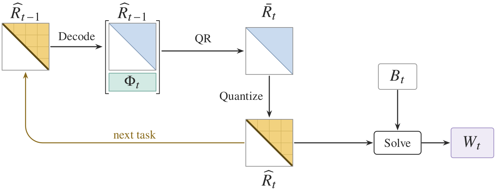

# SRQ: Square-Root Quantized State for Memory-Efficient Analytic Continual Learning



Analytic continual learners accumulate the statistics of a ridge regression
problem instead of storing past samples, and at high feature widths that Gram
state dominates memory. SRQ keeps the state as a mixed-precision square-root
factor: updated by QR, used through triangular solves, and positive definite by
construction. SRQ-Adaptive promotes selected factor blocks to FP16 under a fixed
byte budget, which reduces persistent state by 45--62% across four settings with
FLY-CL and RanPAC while changing mean AIA by less than 0.01 percentage points.

This repository holds the implementation, one configuration per reported run,
the class orders and projection seeds of every paired stream, and the published
per-seed outputs.

## Verify the reported numbers

No GPU, no dataset, no dependency beyond the Python standard library:

```text
python scripts/reproduce.py tables
```

This performs no training. It recomputes the tables from the per-seed outputs in
`results/paper/` and begins with:

```text
Table 1
  CIFAR-100 exact    AIA 92.249 +/- 0.447 state 244.0 MB
  CIFAR-100 srq_int8 AIA 92.231 +/- 0.420 state 97.2 MB
    reduction 60.2%
```

`python scripts/reproduce.py figure2` redraws Figure 2 as a vector PDF and needs
matplotlib.

## Requirements

```text
pip install -r requirements.txt
pytest tests
```

The reported runs used Python 3.13, torch 2.11.0+cu128 and CUDA 12.8 on one
NVIDIA Tesla T4. Install a torch build matching the local CUDA driver; the
default PyPI wheel on Windows is CPU-only. TF32 is disabled in
`experiments/common.py`, so newer GPUs use the same FP32 arithmetic as that T4.

Retraining is bounded by Exact, which holds about five width-by-width FP32
matrices at once: roughly 2 GB of GPU memory at width 10,000 (Tables 1 and 2,
and RanPAC Stanford Cars) and roughly 8 GB at width 20,000 (the rest of Table 3,
and Table 4).

## Data

Datasets, checkpoints and feature caches are not distributed. One command per
dataset downloads what can be downloaded, verifies the backbone against its
recorded SHA-256, and extracts the feature cache:

```text
python scripts/prepare_data.py cifar100
python scripts/prepare_data.py cub200 --archive CUB_200_2011.tgz
python scripts/prepare_data.py cars --root <extracted Stanford Cars folder>
```

CIFAR-100 is downloaded by torchvision. CUB-200-2011 is the official
`CUB_200_2011.tgz` of the [Caltech record](https://data.caltech.edu/records/20098),
and `prepare_cub.py --verify` must report the identity used for the paper.
Stanford Cars is version 2 of the
[classes-folder mirror](https://www.kaggle.com/datasets/jutrera/stanford-car-dataset-by-classes-folder),
which is what the reported runs used, since the original Stanford download is
no longer served; `prepare_cars.py` compares its file manifest with the one used
for the paper and warns when a re-encoded copy would shift the features. The backbones are
[`timm/vit_base_patch16_224.augreg2_in21k_ft_in1k`](https://huggingface.co/timm/vit_base_patch16_224.augreg2_in21k_ft_in1k)
(`model.safetensors`) and the torchvision IMAGENET1K_V2 ResNet-50, both checked
against a recorded SHA-256. Row order follows `orders/`, so a cache extracted
here matches the one used for the paper.

## Reproduce by training

| Command | Artifact | Feature caches |
| --- | --- | --- |
| `reproduce.py table1` | Table 1 | cifar100, cub200 |
| `reproduce.py table2` | Table 2 | cifar100 |
| `reproduce.py table3` | Table 3 | cifar100, cars |
| `reproduce.py table4` | Table 4 | cifar100 |
| `reproduce.py all` | all of the above | whichever are present |

Every command is printed before it runs, so a single run can be copied and
executed on its own. Add `--dry-run` to print without running, `--device cpu` to
force the CPU, or `--features` and `--results` to move the roots. A target whose
cache is missing is reported and skipped, and runs resume: a replicate whose
output file already exists is read back instead of recomputed.

A run prints its seed and task as it goes, and prints its summary when it
finishes. It writes the per-replicate units and a `summary.json` under
`results/`, holding the means, sample standard deviations, state bytes and
paired differences of that run. `reproduce.py tables` reports the published
units and does not read those directories.

## Conventions

- `dAIA = AIA_method - AIA_Exact` in percentage points, negative below Exact,
  averaged over paired seeds rather than taken between two means.
- Persistent state is reported in decimal MB (10^6 bytes) and summed from the
  learner's actual `persistent_tensors()`.
- Exact is reported with lossless upper-triangle accounting in the primary
  tables.
- The budget fraction beta = 0.25 was fixed before any test evaluation; Figure 2
  highlights it for that reason, not because the sweep selected it.
- Block selection uses no labels, logits, predictions or test data.
- The lambda-selection configs are train-only calibration artifacts; the
  selected values are already in the run configs.

## Repository layout

| Path | Contents |
| --- | --- |
| `srq/` | Factor codec, blocked QR update, ridge solve, state accounting |
| `experiments/` | FLY-CL and RanPAC protocols, shared evaluation protocol |
| `configs/paper/` | One configuration per reported run |
| `orders/` | Class orders and projection seeds of every paired stream |
| `results/paper/` | Published per-seed outputs |
| `scripts/` | Entry points and data preparation |
| `tests/` | Codec, QR, ridge and accounting tests, no data needed |

## License

Released under the MIT License. See [LICENSE](LICENSE).

## Citation

> SRQ: Square-Root Quantized State for Memory-Efficient Analytic Continual
> Learning.
